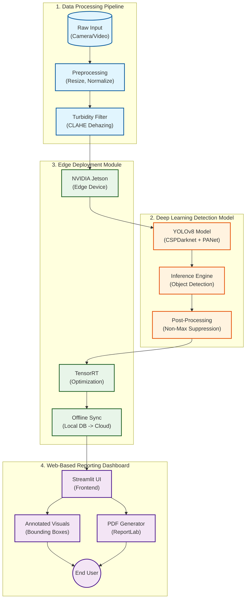

# 🏗️ NautiCAI System Architecture

```mermaid
graph TD
    %% Component 1: Data Processing Pipeline
    subgraph "1. Data Processing Pipeline"
        Input[("Raw Input\n(Camera/Video)")]
        Preproc["Preprocessing\n(Resize, Normalize)"]
        Filter["Turbidity Filter\n(CLAHE Dehazing)"]
    end

    %% Component 2: Deep Learning Detection Model
    subgraph "2. Deep Learning Detection Model"
        YOLO["YOLOv8 Model\n(CSPDarknet + PANet)"]
        Inference["Inference Engine\n(Object Detection)"]
        NMS["Post-Processing\n(Non-Max Suppression)"]
    end

    %% Component 3: Edge Deployment Module
    subgraph "3. Edge Deployment Module"
        Jetson["NVIDIA Jetson\n(Edge Device)"]
        Optimize["TensorRT\n(Optimization)"]
        Sync["Offline Sync\n(Local DB -> Cloud)"]
    end

    %% Component 4: Web-Based Reporting Dashboard
    subgraph "4. Web-Based Reporting Dashboard"
        Streamlit["Streamlit UI\n(Frontend)"]
        Visuals["Annotated Visuals\n(Bounding Boxes)"]
        PDF["PDF Generator\n(ReportLab)"]
        User((End User))
    end

    %% Connections
    Input --> Preproc
    Preproc --> Filter
    Filter --> Jetson
    
    Jetson --> YOLO
    YOLO --> Inference
    Inference --> NMS
    
    NMS --> Optimize
    Optimize --> Sync
    
    Sync --> Streamlit
    Streamlit --> Visuals
    Visuals --> User
    
    Streamlit --> PDF
    PDF --> User

    %% Styling
    classDef pipeline fill:#e1f5fe,stroke:#01579b,stroke-width:2px;
    classDef model fill:#fff3e0,stroke:#e65100,stroke-width:2px;
    classDef edge fill:#e8f5e9,stroke:#1b5e20,stroke-width:2px;
    classDef web fill:#f3e5f5,stroke:#4a148c,stroke-width:2px;
    
    class Input,Preproc,Filter pipeline;
    class YOLO,Inference,NMS model;
    class Jetson,Optimize,Sync edge;
    class Streamlit,Visuals,PDF,User web;
```
