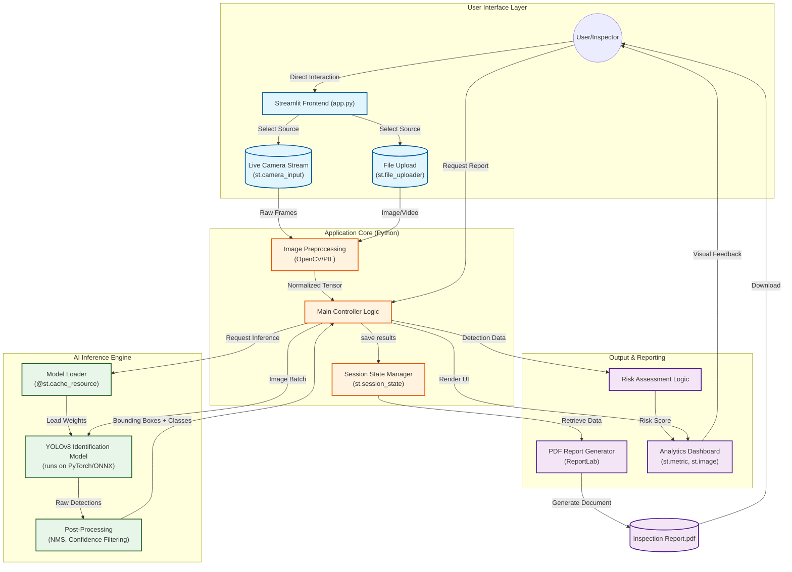

# 🏗️ NautiCAI System Architecture

This diagram illustrates the high-level architecture and data flow of the NautiCAI system.

## Key Components

1.  **Frontend (Streamlit)**: Handles user interaction, camera access, and visualizes results.
2.  **State Management**: Persists analysis data to allow report generation without re-running inference.
3.  **AI Engine**: YOLOv8 model optimized for underwater object detection.
4.  **Reporting Engine**: Custom PDF generator using ReportLab to create professional documentation.
